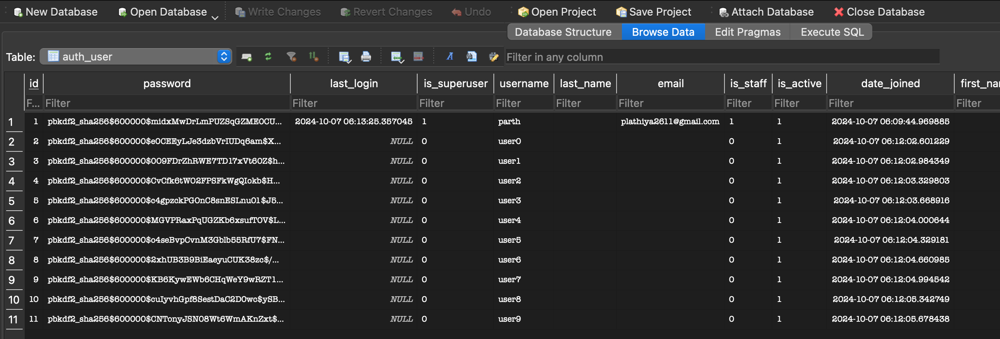
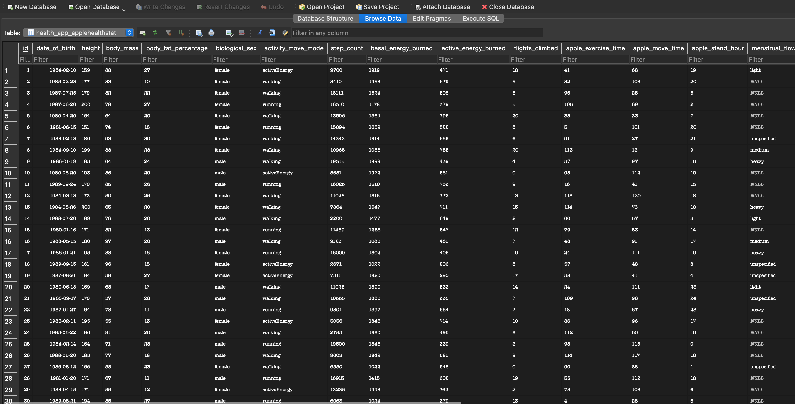

# AI Health Project

## Overview

This project implements a simple AI logic system using Django, Django REST Framework, and OpenAI's ChatGPT API. It analyzes user data from the Apple Health SDK and provides personalized advice based on sleep and activity metrics. The system includes conditions for identifying users with insufficient sleep, users who have walked 10,000 steps today, and users whose step count decreased by more than 50% compared to the previous week.

## Features

- **Random Data Generation**: Populates the database with random user data for testing.
- **API Endpoints**:
  - `/api/sleep-condition/`: Identifies users with insufficient sleep (< 6 hours of sleep per day on average over the past week).
  - `/api/steps-condition/`: Identifies users who have achieved 10,000 steps today.
  - `/api/steps-comparison/`: Identifies users whose step count this week is 50% less than the previous week.
- **AI-Generated Responses**: Provides personalized advice using OpenAI's ChatGPT.

## Task Description
Reference App Link: https://hapday.app

### Task 1 - Analyse competitors and provide a google sheet with list of features I think would be nice to add to Hapday Al
Google Doc Link: https://docs.google.com/spreadsheets/d/1zIbFkN8dsvQdDOqGrxUMKg-2DOls-l1-gheQM_9X6x8/edit?usp=sharing

### Task 2 - Analyse Hapday provide the list of action point on how to improve the current Al functionality (not the whole app, but Al only)
Google Doc Link: https://docs.google.com/spreadsheets/d/1nnBuDlB3vFd89rQ_ZJADpsLZKPLN5lRuffqitxLDiKw/edit?usp=sharing

### Task 3 - Implement Simple AI Logic using ChatGPT API and Django REST Framework
Note: The Dataset of 10 users is randomly generated and for testing purpose only.

The API's along with the AI-generated responses in the provided format are as follows:

```bash
http://localhost:8000/api/sleep-condition/

```

```json
[
    {
        "user": "parth",
        "ai_response": "Hey there! Wow, it sounds like you've had quite the week. I totally get it—sometimes life just gets in the way of catching those precious Z's. But hey, sleep is like the magic elixir for feeling awesome and being productive, so let’s see if we can tweak a few things and get you back on track.\n\nFirst off, don't sweat the stats too much, but they do give us some clues. Since you've logged 0.0 hours—which I'm guessing might be a bit off or just really symbolic of feeling like you’ve “slept none”—let's focus on a few key areas to help you feel more rested and, in turn, more productive:\n\n1. **Establish a Relaxing Night Routine:** Try winding down with something calming, like reading a book or doing a bit of meditation before bed. Keep screens at bay for at least an hour before you hit the hay—blue light can seriously mess with your sleep cycle.\n\n2. **Consistency is Key:** If possible, hit the sack and wake up around the same time each day, even on weekends. It sets your body's internal clock, which can help you sleep better and wake up feeling refreshed.\n\n3. **Watch What You Eat and Drink:** Maybe reign in any late-night snacks or caffeine in the afternoon. Both can sneakily interfere with your shut-eye.\n\n4. **Rethink Your Sleep Environment:** Make sure your bedroom is a sleep haven—cool, dark, and quiet. Might even be worth checking out some white noise machines or blackout curtains if outside noise or light is the villains here.\n\nAs for the data and patterns, let's look at what typically makes you tick:\n\n- **Productive Days:** On good days, is there a pattern like getting in a workout or starting your day with a balanced breakfast? Stuff like morning sunlight or a quick stretch can be great mood and energy boosters.\n\n- **Bad Days:** If there’s anything you’ve tracked about days that feel blah—whether it’s skipping meals, extra stress, or a dull routine—it might be useful to think about how to tackle those. Sometimes, just adding a small dose of something fun or rewarding into your day can lift your spirits.\n\nIt’s all about finding that sweet spot where you feel your best, so don't hesitate to experiment a bit! Even small changes can make a big difference over time. Keep me posted on how things are going, and let's smash through any roadblocks life throws at you! 😊"
    },
    {
        "user": "user9",
        "ai_response": "Hey there! It looks like you're having a bit of a rough patch with sleep, huh? 😴 Only 1.7 hours across the week is super tough, and no doubt it’s making everything seem a little more challenging.\n\nThe good news is your activity levels are impressive. You’ve been crushing it with steps and staying active, so kudos on keeping your body moving! 💪 But, to be your best self, you definitely gotta catch some more Z's.\n\nHere’s what I’m thinking based on all that data:\n\n### **What’s Happening Now:**\n- **Sleep:** This week, sleep was close to nonexistent. Your body probably feels it, like low energy, mood swings, or even just a general ‘meh’ feeling.\n- **Activity:** Despite the lack of sleep, you’re really active—20,000 steps and solid active energy burns (669 kcal). It's clear you’re motivated!\n  \n### **Things to Consider on Bad Days:**\n1. **Get Those Z’s:** Establish a calming bedtime routine. Maybe some light reading or a warm shower before hitting the sack could help.\n2. **Relaxation Techniques:** Try some deep breathing or meditation. Apps like Calm or Headspace can guide you through and help slow down your mind.\n3. **Limit Caffeine & Screens:** Close the coffee mug a few hours before bed and try dimming the screens—a little blue light reduction never hurt anyone.\n\n### **What Boosts You on Good Days:**\n- **Consistency:** When sleep and activity are well-balanced, notice how your productivity and mood typically improve. Rested nights make way for easier, motivated days.\n- **Natural Light:** Walk outside during daylight hours. Bonus, it helps regulate your sleep-wake cycle by anchoring your circadian rhythms.\n\n### **Patterns & Correlations:**\n- **Activity & Mental Alertness:** You’re active, which means you have the energy to start with; imagine doubling that power with more sleep!\n- **Sleep & Recovery:** No sleep means no proper recovery. It’s crucial to replenish your energy reserves, so start aiming for at least 7 hours.\n\n### **Small Tweaks for Big Impact:**\n- **Bedtime Consistency:** Aim for the same sleep/wake times each day, even on weekends.\n- **Create a Sleep Sanctuary:** Comfy pillow, blackout curtains, and a slightly cooler room can invite better sleep vibes.\n\nIn a nutshell, you’re doing great with being active, but your body—an amazing engine—needs good sleep to refuel. Just tweak things here and there, and you’ll feel a difference. 💤\n\nIf you ever wanna chat more, I'm just a message away! Catch those Z's, and keep rocking it. 🌟"
    }
]
```

```bash
http://localhost:8000/api/steps-condition/

```

```json
[
    {
        "user": "user0",
        "ai_response": "Hey there! Wow, 168,610 steps in a day? That's insane! You’re really smashing it. But let’s chat about how you can keep up the good vibes and what might be throwing you off on the not-so-great days.\n\n### Understanding Your Good Days\nIt seems like you have some really high-energy days where everything clicks. Looking at your data, on days when you've taken a ton of steps or burned a bunch of active energy, there might be some key patterns:\n\n1. **Exercise Time:** Your exercise time varies a lot. On days when you felt really productive and hit high step counts, it looks like your exercise sessions were longer. Like, on a good day, if you clocked in 105 minutes of exercise, your body and mind probably felt the boost.\n\n2. **Heart Rate and Variability:** A nice balance here usually indicates your body’s handling stress well. On days with higher heart rate variability, it seems like you’ve been able to handle those kicks from exercise without much drain.\n\n3. **Sleep Consistency:** Yeah, it's clear here! It seems like the days leading up to productive bursts had a couple of consistent sleeping patterns. Not just any sleep, but the quality and maybe even getting a bit more than usual.\n\n### Navigating the Rough Days\nBad days happen – we all know it! But let's dig into what could make those days a little brighter:\n\n1. **Sleep Quality:** On days that are shaky, your sleep might've been broken up or not long enough. It's cool seeing where your sleep was consistent, maybe try an earlier bedtime or a relaxing routine before hitting the hay.\n\n2. **Reduced Steps & Low Energy Burn:** If these are dipping, perhaps on those days, you might need more energy or motivation. Could be something simple like a stroll or just a quick 10-minute workout to get the blood moving.\n\n3. **Heart Rate:** Days with higher heart rates might signal stress or fatigue. Keep an eye on recovery techniques like breathwork or mindful stretching. They can do wonders!\n\n### Plan for More Awesome Days\n\n- **Prioritize Nights:** Aim for bedtime routines to improve sleep duration and quality. Your body will thank you when it's time to crush those steps.\n- **Consistency is Key:** Regular exercise, even just mild activity daily, can help keep energy up without burning out.\n- **Mindset and Balance:** Check in with how you’re feeling stress-wise. If something’s bugging you, tackle it head-on with relaxing activities or a simpler schedule.\n\nTake this week's data as a chapter in your ongoing epic! Use what you've learned to 'write' this next one, being fully equipped to channel those productive days more frequently. You’re doing great, and these tiny tweaks will only skyrocket you further. Keep it up!"
    },
    {
        "user": "user1",
        "ai_response": "Alright, user1, looks like you've got some solid data here to dig into. So, let's break this down and try to figure out what’s made your days awesome and what to tweak on the not-so-great ones.\n\n### Good Days vs. Bad Days\n**Good Days:** Those days where you’re smashing step counts, gaining energy, and basically feeling like a superhero — you’ve got a few standout days there like the 11489 and 19500 step days. What do they have in common? Looks like you've got solid sleep sessions on those days. Sleep is a big one because it fuels your day and keeps stress at bay.\n\n**Bad Days:** Those days when things feel a bit off. Maybe you didn’t hit as many steps or your energy burned wasn’t as high. Sleep again seems to be a factor. Short or restless sleep sessions can kind of mess with your vibe for the day.\n\n### Sleeping Patterns\nFrom your data, it seems like longer, consistent sleep sessions correlate with better productivity and more energy throughout the day. On days where you were more sporadic with sleep, the activity levels dipped. Maybe focus on trying to get a better sleep routine? \n\n### Step Counts and Activity\nYou’re clearly hitting different step counts per day. On days with higher steps, energy burned is also high. It seems when you're engaged in more physical activities, you feel better overall. On days where steps are lower, maybe it’s down to less activity or perhaps more sedentary behavior is creeping in, which can just generally drag you down a bit.\n\n### Correlations\n1. **Sleep Quality:** More consistent and longer sleep correlates with better performance the next day.\n2. **Step Count vs. Energy:** Higher steps lead to more energy burned, which probably boosts your mood and energy.\n3. **Heart Rate Variability (HRV):** When HRV is higher, it usually means your body is more resilient to stress. The higher the HRV numbers, the better your adaptive capacity seems to be.\n\n### Actionable Steps\n- **Improve Sleep:** Try sticking to a sleep schedule, maybe unwinding before bedtime to make sure you hit those longer, restful hours.\n- **Daily Goals:** Set daily step goals to keep your body moving consistently. More movement usually equals more energy!\n- **Relaxation Practices:** Maybe introduce some relaxation techniques like deep breathing or short meditations. They can enhance your HRV and overall energy.\n- **Reflect on High-Energy Days:** Look back at your best days and identify what specifically you did those days—it could be something like a particular morning routine that set you up for success.\n\nKeep up the momentum, user1! You're already doing amazing things with those steps and this data can totally help you take it up a notch."
    },
    {
        "user": "user2",
        "ai_response": "Hey there! It's awesome to see you making strides with your steps. Seriously, 143023 steps in a day? That's next-level stuff! Let's dive into your numbers and see how we can keep this momentum up and also tackle those not-so-great days.\n\n### Good Day Analysis:\nYou've had some stellar days, like the one with 17220 steps and another with 16576. These days stand out with pretty solid active energy burned, which means you were moving quite a bit, and your exercise times were longer. It's possible these days were filled with walking or some planned exercise that got your step count up. \n\nYour sleep analysis also gives us some clues. For days you hit big numbers, like the 13k+ steps day, your sleep patterns were a bit more consistent. Having segments of consecutive uninterrupted sleep seemed to correlate with a productive day. Regular and restful sleep definitely plays a big role.\n\n### Bad Day Analysis:\nOn your lower step count days, like the 2415 steps or 4425 steps days, it looks like your active energy burned was lower. These might have been rest days, or maybe you were just super busy with something that didn't involve a lot of moving around.\n\nSleep-wise, interruptions or shorter sleep times might have made you feel like lounging more. Noticing fluctuations in your heart rate variability can also hint at stress or needing more rest, which might have affected your steps.\n\n### Strategy for Improvement:\n1. **Consistency is Key:** Try keeping your sleep schedule steady. Aim to go to bed at the same time and get up at the same time each day. That might help you feel fresher and ready to move more.\n\n2. **Mix Up Your Movement:** If hitting a certain step count seems tough some days, throw in some short exercises you can do indoors, or plan little walking breaks throughout your day.\n\n3. **Listen to your Heart Rate Variability (HRV):** Use days when your HRV is high as indicators you can push a bit harder, and when it's lower, maybe take it a bit easier to avoid overstraining.\n\n4. **Plan for Rest and Recovery:** On days you know you'll be busy or stressed, consciously take short walks or do some stretching to keep active without overexerting.\n\n5. **Celebrate Small Wins:** Recognize and reward yourself for those big days! Maybe keep track and try to match or beat them with a reward system – whether it's a treat or some downtime with your favorite hobby.\n\nThink of each day as a building block. The key is to keep stacking those blocks regularly, even if some days are smaller than others. Keep going strong, and remember to give yourself grace on those tougher days. You're doing great! 🤗"
    },
    {
        "user": "user3",
        "ai_response": "Hey there! So, looking at your activity data, it’s clear you’re doing a fantastic job keeping up with your step count. Seriously, 145,881 steps is no small feat! Let’s dive into what’s been helping you crush it on good days and see how we can tackle those not-so-great days.\n\n### Good Days vs. Bad Days\n\n**1. Good Days:**\n   - **High Step Counts:** Days like when you hit that massive 18,420 steps are golden! It seems like you were quite active, possibly engaging in a particular workout or there was just a lot of walking involved.\n   - **Steady Heart Rate:** On your high-step days, your heart rate seems balanced and you climbed a few flights, suggesting you probably had a good mix of cardio and strength activities.\n   - **Consistent Sleep Patterns:** Even though sleep durations vary, having a few longer restful nights like over 5,500 seconds seem to align with productive days.\n\n**2. Bad Days (a.k.a not as active):**\n   - **Lower Step Counts:** Days with only a few steps (like 30 – that’s practically couch potato status!) might correlate with less energy or possibly being indoors.\n   - **Less Sleep:** Days where your sleep is broken up a lot and totals less together might lead to feeling a bit less energetic. Look out for nights with a bunch of short sleep times.\n   - **Higher Heart Rates Post-Activity:** On less active days, keep an eye on higher heart rates post-activity, which might mean you're pushing a bit too much at times when you're already tired.\n\n### How to Keep the Momentum:\n\n1. **Plan Active Days:**\n   - Try scheduling fun activities or workouts on days when you usually have higher energy. If you know you’re not motivated to move alone, maybe pair this with a group activity or a buddy.\n\n2. **Prioritize Sleep:**\n   - Ensure you’re striving for solid sleep hours. Aim for fewer interruptions by perhaps adjusting your nightly routine — maybe some calming techniques like reading a bit or practicing mindfulness before hitting the hay.\n\n3. **Variety in Routine:**\n   - On days you hit less than your step goal, mix in quick, varied exercises to prevent stagnation and keep it interesting. Short bursts can be just as effective for maintaining energy levels.\n\n4. **Listen to Your Body:**\n   - Pay attention to how certain activities impact your energy. If you feel worn out on low step days, a gentle workout like yoga or stretching might do the trick to reset and refresh your system.\n\n5. **Celebrate Wins:**\n   - Reflect on what went right on those high-step days and find ways to recreate similar conditions, whether it’s planning more outdoor activities or setting challenges for yourself.\n\nTrying to get those consistent good days is all about balancing activity with your rest and listening to what your body needs. You’re doing super well already, and with these little tweaks, you’ll be able to enjoy even more productive days ahead! Keep on moving!"
    },
    {
        "user": "user4",
        "ai_response": "Hey there! First off, kudos on getting an incredible number of steps in! 152,103 steps is no joke—that’s major dedication. 🎉\n\nNow, let's dive into your week and see what's been happening. You've done a bunch of steps, and there's some variety in other metrics too which can give us clues about how you're feeling on your \"good\" versus \"bad\" days.\n\n### **Understanding Productive Days:**\n\n- **Steps & Activity**: On days when your step count is higher, like the days where you hit over 14,000 steps, you've usually had higher active energy burned and often a decent amount of exercise time logged. It seems like staying active really gets your energy levels up!\n\n- **Sleep Habits**: On active days, it looks like you get a solid mix of sleep cycles. For instance, when you’ve had a good spread of sleep blocks, especially with a couple of longer stretches, you have more energy the next day. It seems like a consistent bedtime and wake time routine might be helping keep your energy stable.\n\n### **Conquering Off Days:**\n\n- **Less Activity & Energy Slumps**: Days where your steps are lower seem to coincide with fragmented or less sleep. It's like there's a direct line between how rested you are and your activity levels.\n\n- **Sleep & Heart Rate**: On days when your heart rate is a bit higher or there’s lesser variability, like those without prolonged sleep blocks, the next day can be tougher in terms of energy. It's a reminder that rest is just as important as the steps!\n\n### **What Might Help—Moving Forward:**\n\n- **Consistent Sleep Routine**: Try sticking to a bedtime schedule as much as possible. Even on weekends, giving yourself a consistent wind-down time could help regulate your energy and activity levels.\n\n- **Mixing It Up**: Keeping workouts varied with a mix of intensity might help. High step counts can be great, but even light movement or stretching might help on days when you're not feeling 10/10.\n\n- **Mind the Recovery**: If you notice a big drop-off in how you're feeling, it could be worth looking at recovery strategies—think more sleep, maybe a rest day, or just some chill time to recharge.\n\nOverall, you've got a great baseline here, just listen to your body and adjust as needed. You've been doing amazing, and with a few tweaks, you can maintain that momentum even on the tougher days. 🚀\n\nLet me know if you need any more tips or if there’s something specific you want to focus on!"
    },
    {
        "user": "user5",
        "ai_response": "Hey there! You've been absolutely killing it with those steps—171,149 is seriously impressive! It sounds like you've got a great routine going on certain days. Let's break it down a little and see if we can figure out what's working and what could use a tweak.\n\n### Top Performers:\n1. **High Step Counts & Active Days**: On days like October 7 and others where your step count soars, you seem to have a nice mix of higher exercise time and good heart variability. Those longer walks or workouts are definitely paying off!\n2. **Consistency with Sleep**: Your sleep patterns fluctuate a bit, but on days when you get a solid block of rest, like around October 6, it’s clear you’re more active and feel better overall. It’s amazing what a good night’s sleep can do, right?\n\n### The Not-So-Great Days:\n1. **Lower Step Counts**: Days where steps drop significantly often coincide with higher heart rates or variability, and sometimes less sleep. It might be an indicator of stress or simply a busy day that wasn't focused on physical activity.\n2. **Exercise Time**: Some days, your exercise time is minimal. When this is paired with less rest, it's harder to get those steps in and feel up to par. We all have those days though—life gets in the way.\n\n### How to Keep Crushing It:\n1. **Prioritize Sleep**: Aim to wind down a bit earlier if possible, or incorporate factors to improve rest, like a relaxing pre-sleep routine. That regular good night’s sleep leads to awesome results the next day. \n2. **Sneak in Movement**: On days you're less active, think about small ways to add movement—maybe short walks or even quick exercises during breaks. Little efforts add up and keep that energy up.\n3. **Mind Your Heart Rate**: Keep an eye out for days with higher heart rates. It could help highlight days you might be feeling stressed. Breathing exercises or short meditations can help dial it down.\n\n### Comparing & Moving Forward:\nBy comparing your top step days with those that lag behind, it's clear that a combo of good rest, consistent movement, and a moderate heart rate is your sweet spot. Try building on patterns from your best days and look out for the signs on tougher ones. Remember, everyone has days where things don’t go as planned—what matters most is finding that balance and making small changes that fit into your lifestyle.\n\nHope this gives a clear picture and keeps you motivated! If you’ve got any other areas you're curious about or thoughts on these patterns, feel free to share. 🌟"
    },
    {
        "user": "user6",
        "ai_response": "Hey there! First of all, congrats on hitting such an impressive step count—136,179 steps! That's some serious dedication. Now, let's dive into your week and see what's up.\n\n### Analyzing the Data\n1. **Good Days vs. Bad Days**:\n   - **Good Days**: Looking at your best step days like with 19,934 steps or 17,418 steps, you burned a lot of active energy and had decent heart rate variability. These days were probably fueled by staying active throughout.\n   - **Bad Days**: On days with lower steps, like 24 or 2,714 steps, even though your active energy burned didn't plummet, your heart rate was a bit higher and variability lower, suggesting you might have been stressed or fatigued.\n\n2. **Sleep Patterns**:\n   - **Sleep on Good Days**: You seem to have had a solid sleep structure before your good step days. For instance, on nights leading to good days, sleep duration was ample and spread across different time slots, giving you a chance to recover well.\n   - **Sleep on Bad Days**: On the flip side, fragmented or short sleep spans seem to precede days with less activity. Ensuring consistent sleep, even if broken up, could boost energy levels.\n\n3. **Heart Rate and Variability**:\n   - You seem to dart into higher heart rate ranges on days with less activity. This might be linked to stress or recovery needs. Keeping an eye on relaxing activities or mindfulness exercises could benefit you.\n\n### Personalized Advice for More Good Days:\n- **Maintain Consistent Sleep**: Try sticking to a consistent sleep schedule. Even if your sleep is broken up, consistency helps regulate your body's clock.\n  \n- **Tackle Light Activity**: On lower step count days, even small activities can make a big difference. A short walk every couple of hours or desk exercises can boost your daily steps.\n\n- **Mindful Breaks**: Incorporate short breaks with deep breathing or light stretches. This could reduce stress, stabilize your heart rate, and boost heart rate variability over time.\n\n- **Reflect on Good Days**: Identify what made your good days great. Was it specific activities, moods, or routines? Try to replicate those.\n\n- **Recovery Days**: On days you feel off, don’t push too hard. Your body sometimes just needs rest. Listen to those cues.\n\nBy keeping tabs on your sleep pattern, managing stress, and finding activities that keep you moving even a little, you can create more days with higher productivity. Remember, it's not all about numbers; balance is key! Keep up the great work, and don't forget to celebrate your achievements, big or small! 🌟"
    },
    {
        "user": "user7",
        "ai_response": "Hey there! First off, congrats on rocking those steps—128,075 is seriously impressive! Let’s dive into your health data and see what gems we can find to keep you on track and bump up those good days even more.\n\n### Step Count & Activity:\nYou've got some majorly off-the-charts days with steps, while others are a bit lighter. On your highest step days, like when you hit 18,920 steps, it seems like your energy burned and sleep might be playing a big role too. High activity generally lines up with days when you tend to have a solid base of sleep and consistent exercise time.\n\n### Sleep:\nSpeaking of sleep, on the days you crushed your steps, your sleep seems a bit better organized, with fewer fragmented periods. Keeping to a more structured sleep schedule could really help those lighter days to transform into more energetic ones.\n\n### Heart Rate & Variability:\nA balanced heart rate variability (HRV) can be a good sign, reflecting how well your body's top-notch at managing stress and bouncing back from activity. The days when your HRV and steps are both good—like the days sitting around the 80 HRV mark—seem to be working in sync. Maybe some mindfulness practices or stretching could enhance your HRV on the days it dips a bit.\n\n### Oxygen Saturation:\nYour oxygen levels have been pretty steady, mostly in the high 90s, which is fantastic! There are days it's a tad lower, paired with lower step days. Staying hydrated and getting good airflow, especially while sleeping, can keep this at its peak.\n\n### Energizing Tips:\n1. **Consistent Sleep Routine**: Since good recovery sleep drives up your productivity and energy, try setting a consistent bedtime and wake-up routine.\n2. **Mindful Movement**: See if you can sneak in a short walk or some stretching on days when you’re under the weather to give yourself a boost.\n3. **Manage Stress**: A few minutes of deep breathing or some meditative listen-and-breathe times might help enhance that HRV and keep you feeling relaxed and ready.\n4. **Hydration & Nutrition**: Fueling your body with the right nutrients and staying hydrated can support both your oxygen levels and overall energy.\n\nBy linking together your period of excellent steps, consistent sleep, and higher HRV, you can construct a routine that keeps the momentum rolling. Try tweaking one or two areas, and see if it lines up with an increase in those numbers on a regular basis. You’re already doing great, and a few small changes could make all the difference. Keep it up! 🎉🏃‍♂️💪"
    },
    {
        "user": "user8",
        "ai_response": "Hey there! First off, wow, that's a crazy impressive step count—113,708 steps! You're like a walking champ. Let’s take a closer look at your week and see if we can figure out some patterns to keep those good vibes rolling even on your off days.\n\n### Good Days Analysis\nSeems like the days you rocked the steps (like the 19,715-step day) were also days where you had a bit of higher active energy burned (780) and more exercise time (98 minutes). High step counts and great active burn usually correlate pretty nicely. This suggests that on those days, you were both active and likely had a structured exercise routine or longer, consistent walks.\n\n### Bad Days Pattern\nOn the other side, days with lower step counts (like that 43-step day—it happens to the best of us!) seem to line up with less energy burned and lower exercise time. This could be due to a mix of things like not getting moving early in the day, being stuck with inside work, or just needing a well-deserved break.\n\n### Sleep and Energy Connection\nLooking at your sleep stats, it’s clear that varied sleep segments are part of your routine, though sometimes the total sleep time might be a bit choppy. Getting good rest seems to help with more active days, so prioritizing solid, uninterrupted sleep, wherever possible, could help keep your energy up for those big days of movement.\n\n### Heart Rate and Step Count\nNotice also how on days when your heart rate is a bit more consistent and not overly spiking, your activity tends to be steadier. Managing stress, staying hydrated, and warming up properly before any intense activities can help keep your heart rate in a nice, steady zone.\n\n### Tips for Keeping Momentum:\n- **Routine Building:** Try to get in a morning walk or some light exercise to kickstart your day, even if it's shorter. It sets a positive tone.\n- **Break Up Sedentary Time:** On lower step count days, set reminders to take short walks or do some stretches. Every little bit counts towards more overall movement.\n- **Sleep Consistency:** Aim for a more uniform sleep schedule if possible. A well-rested body is much more equipped to tackle activity!\n- **Stress Management:** Stress can mess with heart rate and step count—find activities that help you stay chill, like yoga, meditation, or simply a bit of downtime.\n\nTake these insights as little nudges towards finding what balance works best for you. You've already shown you can crush it, and keeping these things in check will only boost your awesome streak!"
    }
]
```


```bash
http://localhost:8000/api/steps-comparison/

```

```json
[
    {
        "user": "user9",
        "ai_response": "Hey there! It looks like last week you really hit the ground running (literally!) with those 20,000 steps. This week, it's understandable it didn't quite match up, and that's totally okay—life gets busy, or sometimes we just need a break. It's awesome that you're checking in with yourself, though. Let’s take a closer look at your activity and how we might keep those steps in view without feeling like it’s a chore.\n\n### Good Days vs. Bad Days\n\n**Good Days (Last Week):**\n- **Steps:** 20,000\n- **Active Energy Burned:** 699 calories\n- **Sleep:** Looks like you got about 50 minutes of sleep, which isn’t much. Hope it was a restful short nap rather than usual!\n  \n**Bad Days (This Week):**\n- **Steps:** 8,000\n- **Active Energy Burned:** Still burned the same amount of active energy, which is impressive! That means even with fewer steps, you might have been doing some other exercises.\n- **Sleep:** Got a sweet 53 minutes. Maybe that's helping balance things out?\n\n### What Helped on the Good Days?\n\n1. **Consistency & Routine:** Last week's step count might be from having a super consistent routine or maybe some extra motivation or fun. Did you have a reason to walk more, like exploring a new place or just generally feeling more up for it?\n\n2. **Activity Type:** Besides just steps, you might have been doing other activities that felt rewarding or engaging. Keep doing things you genuinely enjoy.\n\n### Advice for the Surprisingly Tough Weeks:\n\n1. **Small Goals:** Try a 10-minute walk around your block or find a new podcast series that’ll make you want to walk another lap just to finish the episode. \n\n2. **Mix It Up:** If walking feels meh, try something different. Maybe dance in the living room or take a leisurely cycle around.\n\n3. **Check-In on Sleep:** Your sleep seemed decent both weeks, so that's great! Make sure to keep those sleep routines or even sneak in a nap, if possible, to recharge.\n\n4. **Be Kind to Yourself:** Even pro athletes have off days. It’s cool. Take it easy on yourself and remember, any movement is good movement.\n\n### Keep It Moving Forward\n\nTry setting loose, flexible goals that aren't only about numbers. Enjoy the process and celebrate any movement. Feel free to share what works for you, or let’s brainstorm together next steps if you’re looking for more ways to stay active and happy!\n\nYou've definitely got this, and it's awesome that you're staying connected with your health and activity levels. Keep it up, step by step! 🚶‍♂️💪"
    }
]
```


## Project Running Instructions

#### Create and Activate a Virtual Environment
```bash
virtualenv venv
source venv/bin/activate
```


#### Install Dependencies
```bash
pip install -r requirements.txt
```


#### Configure Environment Variables
Create a .env file in the root directory and add your OpenAI API key:
```
OPENAI_API_KEY=your_openai_api_key_here
```


#### Create and Apply Migrations 
```bash
python manage.py makemigrations
python manage.py migrate
```


#### Generate Random Data
```bash
python manage.py generate_random_data
```


#### Create Superuser
```bash
python manage.py createsuperuser
```

- username: parth
- email: plathiya2611@gmail.com
- password: ai_health_project


#### Run the Development Server
```bash
python manage.py runserver
```


## Execution Screenshots



 


